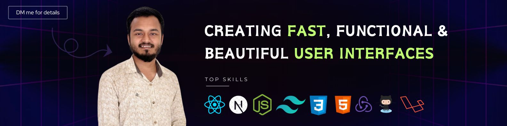

<!--## Hello :wave:, I'm Mehedi Hasan Rahat
<h3 align="center">A passionate frontend developer from Bangladesh</h3>
<p align="center">

</p> -->

<!-- - 🌱 I’m currently learning **React JS**

- 👨‍💻 All of my projects are available at [https://mehedihasan-1.web.app/](https://mehedihasan-1.web.app/)

- 📫 How to reach me **mmmehedi53@gmail.com**

- 📄 Know about my experiences [Resume](https://drive.google.com/file/d/15Tpm4zu8hcfFJBC2hcr3ad4oMSGFfikY/view)

- ⚡ Fun fact **"Any fool can write code that a computer can understand. Good programmer write code that human can understand"-Martin Flowrer** -->

## 🛠 Technical Skills:

```bash
├── Languages
│   ├── JavaScript/TypeScript
├── Front-End
│   ├── HTML5, CSS3, Bootstrap, ReactJS, SASS, NextJS, ReduxJS, ReduxToolkit, ReactQuery, React Router Dom, TailwindCss
│   ├── Styled Components & Emotion, MUI and various other component libraries.
├── Back-End
│   ├── NodeJS (ExpressJS), Laravel(Basic)
├── Database
│   ├── MySQL
│   ├── MongoDB (Mongoose)
├── Tools
│   ├── VS Code
│   ├── NPM
│   ├── Yarn
│   ├── Git
└──
```

### 🔗 Follow Me:-

[](https://mehedihasan.tech)
[](https://www.linkedin.com/in/mhhasanmehedi/)
[](https://twitter.com/mhhasanmehedi)

<p style="text-align: center!important;background: #0D1120;padding: 5px;font-weight:bold">Thanks for visiting my profile :heart:</p>
