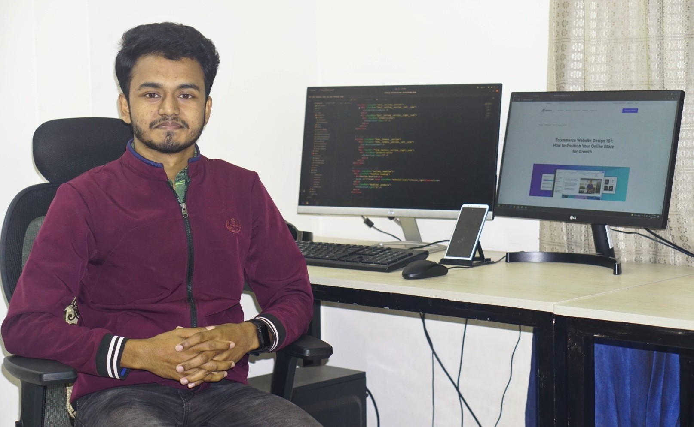

<h3 align="center">A passionate frontend developer from Bangladesh</h3>

- 🌱 I’m currently learning **React JS**

- 👨‍💻 All of my projects are available at [https://mehedihasan-1.web.app/](https://mehedihasan-1.web.app/)

- 📫 How to reach me **mmmehedi53@gmail.com**

- 📄 Know about my experiences [https://drive.google.com/file/d/1qSeWOcvAaSE5pg94Omqfp2IHaVBxbEAl/view](https://drive.google.com/file/d/1qSeWOcvAaSE5pg94Omqfp2IHaVBxbEAl/view)

- ⚡ Fun fact **"Any fool can write code that a computer can understand. Good programmer write code that human can understand"-Martin Flowrer**

<h3 align="left">Connect with me:</h3>

<h3 align="left">Languages and Tools:</h3>

 

